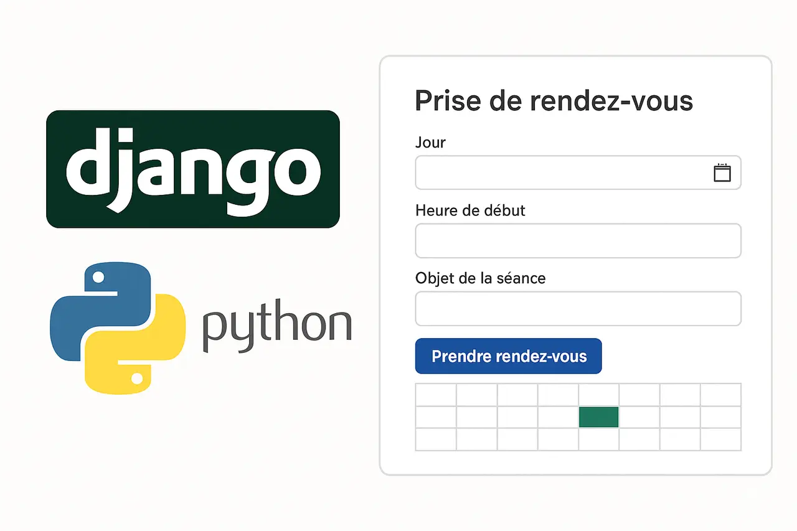
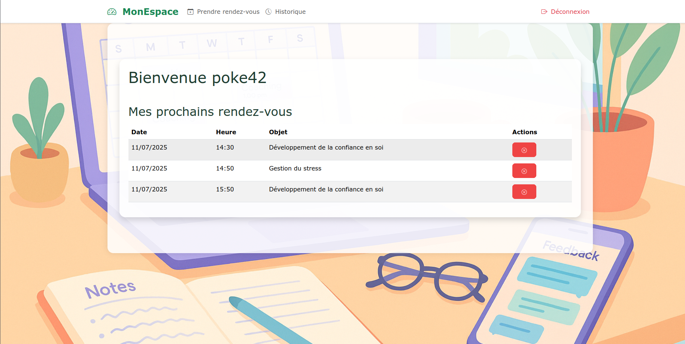
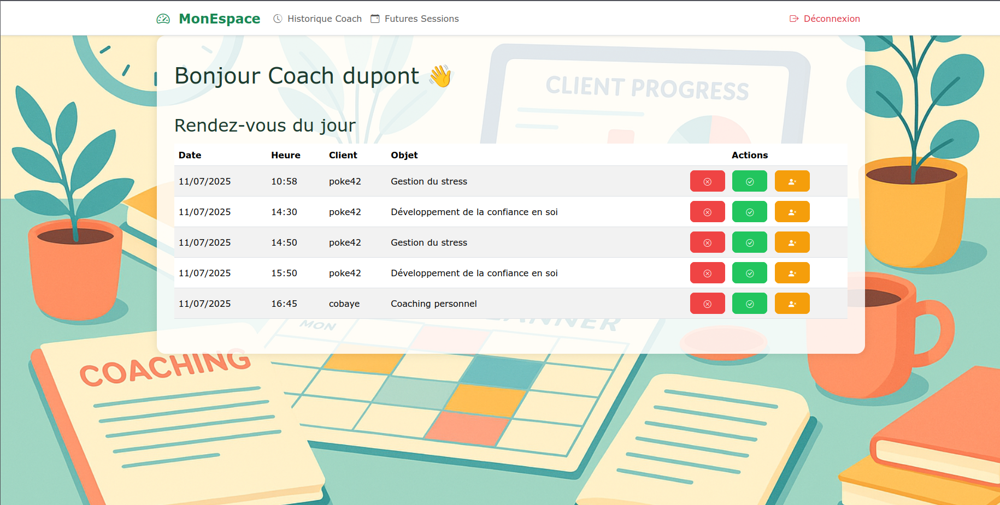

# 🧠 Dupont Ipsum – Plateforme de coaching personnel

Dupont Ipsum est une plateforme web de coaching personnel permettant la gestion de rendez-vous entre coachs et clients.


* * *

## 📁 Structure du projet

```bash
tp_django_coach_client
├── accounts/                 # Gestion des utilisateurs (authentification, dashboard, etc.)
├── core/                    # Accueil et pages générales
├── seances/                 # Module de réservation, historique, gestion des rendez-vous
├── static/                  # Fichiers CSS/JS/images partagés
├── templates/               # Template principal (base.html)
├── personnal_coaching/      # Paramètres et configuration du projet
├── db.sqlite3               # Base de données SQLite
├── manage.py                # Commandes de gestion Django
├── README.md                # Documentation du projet
├── requirements.txt         # Dépendances Python
└── LICENSE                  # Licence du projet

```

## ⚙️ Fonctionnalités principales:

### 👤 Côté client:

- Inscription / Connexion
    
- Dashboard personnalisé avec :
    
    - Prochains rendez-vous
    - Annulation de rendez-vous via modal
    - Modal de confirmation (Bootstrap)
    - Modals pour messages de bienvenue ou succès
- Historique des rendez-vous passés
    

### Exemple – Dashboard client



### 🧑‍🏫 Côté coach:

- Dashboard du jour
    - Actions : annuler, marquer comme absent, confirmer fin
    - Modal avec textarea pour ajouter une note lors de la fin
- Historique des séances
- Liste des séances passées
    - Dropdowns dans un offcanvas pour gérer les séances oubliées
    - Séances passées non clôturées détectées automatiquement (à partir du jour suivant).

### Exemple – Dashboard coach



### 🛠️ Technologies utilisées:

- Django (Python)
- Bootstrap 5 (interface responsive)
- Flatpickr (sélecteur de date)
- SQLite (base de données)
- HTML/CSS/JS (template rendering via Django)

🧪 Installation et lancement:

1.  **Cloner le projet :**
    
    ```bash
    git clone https://github.com/votre-utilisateur/dupont-ipsum.git
    cd tp_django_coach_client
    ```
    
2.  **Créer un environnement virtuel et l’activer :**
    
    ```bash
    python -m venv env
    source env/bin/activate  # Linux/Mac
    env\Scripts\activate     # Windows
    
    ```
    
3.  **Installer les dépendances :**
    
    ```bash
    pip install -r requirements.txt
    ```
    
4.  **Migrer la base de données :**
    
    ```bash
    python manage.py migrate
    ```
    
5.  **Créer un super utilisateur (admin) :**
    
    ```bash
    python manage.py createsuperuser
    ```
    
6.  **Lancer le serveur :**
    
    ```bash
    python manage.py runserver
    ```

Accéder à l'application sur : http://127.0.0.1:8000

* * *

## 🔐 Authentification

- **URL d’inscription :** `/signup/`
    
- **Connexion :** `/login/`
    
- **Déconnexion :** `/logout/`
    
- **Dashboard :** `/dashboard/` (redirige vers client ou coach selon le rôle)
    
* * *

## 🧭 Navigation par rôle

| Rôle | Vue principale | Fonctionnalité clé |
| --- | --- | --- |
| Client | `dashboard_client.html` | Prise et annulation de rendez-vous |
| Coach | `dashboard_coach.html` | Validation ou suppression des séances |

* * *

## 📷 Interface utilisateur

- **Toasts** Bootstrap pour afficher les messages de succès (inscription, confirmation)
    
- **Modals** pour les actions critiques (annulation, validation, absence)
    
- **Offcanvas** pour les séances oubliées dans `historique_coach.html`
    

## ✅ TODO (prochaines étapes possibles)

- Pagination des historiques
    
- Ajout de notifications email (envoi après confirmation ou annulation)
    
- Filtrage des rendez-vous par coach ou date
    
- Export PDF ou Excel de l’historique
    
* * *

## 📄 Licence

Ce projet est sous licence **MIT**. Voir le fichier `LICENSE`.

